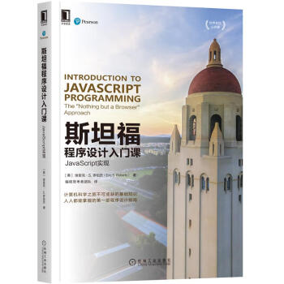

## 编程思考者是什么？

“编程思考者”是一个团队名字。从名字可以看出，是一群热爱代码并乐于思考的编程者。

## 为什么要成立这么样一个团队？

我们是一群软件工程师，除了平时交流技术外，也想为这个软件行业共享一点自己的价值。

## 目前团队成员有哪些？

编程思考者团队成立于2019年10月份。因为团队很多工作需要彼此高度配合，对加入团队的成员有很长的考察期。

截止目前成员如下：

- 钱昱

- 浪里行舟

- 老姚

- 陈大鱼头

- 李世奇

- 桃翁

- 万奇华

- yck

- Dendoink

- Marcus

## 作品

译作:《斯坦福程序设计入门课：JavaScript实现》

本书是斯坦福大学的计算机科学首门课程教材（通常称为CS1）,各大平台均有出售。例如：

https://item.jd.com/10024849465428.html

